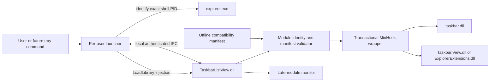
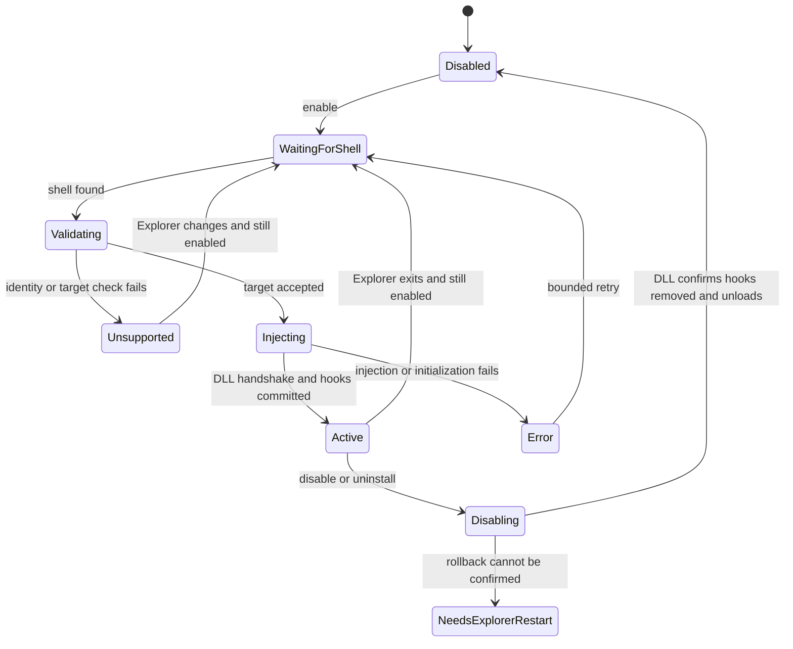

# Minimal Standalone Host Design

## Status

Proposed architecture only. No implementation or Windows build is supported.

## Design Goals

- Change only grouped taskbar click behavior.
- Target only the current interactive shell's x64 `explorer.exe`.
- Keep the runtime offline and free of telemetry.
- Refuse unknown or partially matched builds.
- Restore native behavior on disable, host exit, uninstall, or Explorer exit.
- Avoid Windhawk runtime code and general-purpose mod-host features.

## Architecture

## Components

### Launcher

One x64 per-user process:

- Enforces a single instance per logon session.
- Reads a minimal local enabled flag.
- Uses `GetShellWindow` to identify the actual shell PID.
- Verifies path, user SID, session, and architecture.
- Injects only `TaskbarListView.dll`.
- Waits on the shell process handle and reinjects after a restart.
- Hosts local IPC for status and orderly shutdown.
- Does not enumerate and inject into arbitrary `explorer.exe` processes.

A future tray icon can be a thin front end to the same launcher state machine.
It is not required for the first prototype.

### Injected DLL

One DLL loaded only in the verified shell process:

- `DllMain` records the module handle, disables unnecessary thread callbacks,
  and starts no complex initialization under the loader lock.
- A dedicated worker performs module discovery, identity validation, hook
  creation, IPC, and shutdown.
- Hook code implements only the native list-on-click behavior.
- No settings engine, plugin loader, scripting, updater, or network client is
  present.

### Offline Compatibility Manifest

The runtime manifest is generated ahead of release. A module identity should
contain at least:

- Lowercase module name.
- Machine type.
- PE `TimeDateStamp`.
- PE `SizeOfImage`.
- CodeView PDB GUID and age.
- File version for diagnostics.

Each target record contains:

- Stable project target ID.
- Diagnostic decorated/undecorated symbol name.
- RVA from module base.
- Expected entry-byte fingerprint, with an explicit mask if relocation or
  build-specific bytes require it.
- Expected function prototype/profile version.

The PDB identity is the primary exact-build key. File version is not enough.

The runtime performs no symbol-server request. DbgHelp or DIA belongs only in a
separate maintainer tool that creates reviewed manifest entries.

## Hook Profiles

A profile is an all-or-nothing set of required targets for one exact group of
module identities. Profiles must not infer compatibility from OS build alone.

### Classic List-on-Click Profile

Required private targets in `taskbar.dll`:

- `CTaskListWnd::_DisplayExtendedUI`
- `CTaskListThumbnailWnd::_CanShowThumbnails`

Behavior:

- Suppress non-persistent display requests.
- Allow persistent click requests.
- Return false from thumbnail capability so native UI uses its compact list.

### XAML List-on-Click Profile

Required private targets in `Taskbar.View.dll` or
`ExplorerExtensions.dll`:

- `HoverFlyoutModel::TransitionToFlyoutVisibleStickyState`
- Exactly one known
  `HoverFlyoutController::ShowTaskListButtonHoverFlyout` prototype
- `FlyoutFrame::CanFitAndUpdateScaleFactor`

Required exports in `win32u.dll`:

- `NtUserShowWindow`
- `NtUserEnableWindow`

Behavior:

- Delay show/enable operations only while the known hover path executes.
- Release the pending operations during the sticky click transition.
- Return false from the fit check to select the compact list.

### Mixed Profiles

Some builds may contain both implementations. The manifest may declare both
sets required if testing proves both are exercised. The DLL must install the
declared profile as one transaction. It must not silently continue with a
subset because that can produce hover suppression without a usable click
flyout, or force a list without correct sticky-state handling.

### Explicitly Excluded Hooks

- `CTaskListWnd::_ShowToolTip`
- `GetWindowBand`
- Virtual desktop switcher handling
- ExplorerPatcher `ep_taskbar.*` exports
- `LoadLibraryExW`

## Launcher State Machine

Retries must be bounded and logged. An unsupported identity is not a transient
error and should not be retried repeatedly for the same shell process.

## Target Selection and Injection

### Target Selection

1. Call `GetShellWindow`.
2. Obtain its PID with `GetWindowThreadProcessId`.
3. Open the process with only the rights required for verification and
   injection.
4. Verify canonical image path is the Windows shell `explorer.exe`.
5. Verify the process belongs to the current interactive session and user.
6. Verify x64 with `IsWow64Process2`.
7. Hold the process handle for restart monitoring.

This is intentionally narrower than matching `explorer.exe` by name.

### Injection Mechanism

For the prototype, a conventional same-architecture `LoadLibraryW` injection
is sufficient to test feasibility:

- Allocate the absolute DLL path with `VirtualAllocEx`.
- Copy it with `WriteProcessMemory`.
- Resolve the target process's `LoadLibraryW` address from the appropriate
  module base plus export RVA; do not assume identical ASLR addresses.
- Start it with `CreateRemoteThread`.
- Wait for completion, free the remote path, and require an authenticated DLL
  handshake before reporting success.

The DLL path must be absolute and stored in a user-controlled directory whose
ACL prevents modification by other users. The launcher must never accept an
arbitrary DLL path from IPC or command-line input.

This mechanism may trigger endpoint-security products. That is a documented
compatibility risk, not a reason to broaden privileges or add a service.

## Initialization Sequence

1. DLL worker connects to launcher IPC and reports its Explorer PID.
2. Enumerate already loaded relevant modules.
3. Read module identities from in-memory PE metadata.
4. Select one exact manifest profile.
5. Validate every required RVA and function-entry fingerprint.
6. Create all detours without enabling them.
7. Register late-module observation if the profile permits a relevant module
   to load later.
8. Queue-enable all ready hooks and commit once.
9. Rescan modules to close the initialization race.
10. Report `active` only after the complete profile is committed.

On any failure, disable/remove all hooks created in this attempt and report
`unsupported` or `error`. Partial operation is forbidden.

## Late Module Handling

`Taskbar.View.dll` or `ExplorerExtensions.dll` may not exist when the injected
DLL initializes.

Recommended handling:

- Scan first with normal module APIs.
- Dynamically resolve and register `LdrRegisterDllNotification`.
- Keep the notification callback inside the injected DLL and extremely small.
- In the callback, only recognize the relevant base name and record a
  preallocated atomic notification.
- Let the worker thread perform identity checks and hook installation later.
- Rescan after registration to close the scan/register race.
- If registration is unavailable, use low-frequency worker polling until the
  required module appears.

Microsoft warns that a DLL notification callback must not call functions in
other modules. It must never run symbol logic, MinHook, IPC, allocation, or
logging.

If a required late module cannot be matched, the DLL remains inactive and
reports unsupported. It does not install the remaining hooks.

## Hook Transaction and Concurrency

The project wrapper over MinHook should expose:

- `CreateRequiredHook`
- `QueueEnableAll`
- `Commit`
- `QueueDisableAll`
- `RemoveAll`

Initialization rules:

- Validate targets before patching.
- Create every required trampoline first.
- Queue all enables and call `MH_ApplyQueued` once.
- If any step fails, remove every hook created by the transaction.

Shutdown rules:

- Set `stopping` before disabling hooks.
- Reject new late-module work.
- Queue-disable all hooks and commit.
- Wait for per-detour active-call counters to reach zero.
- Remove hooks and call `MH_Uninitialize`.

Every detour increments an active-call counter on entry and decrements it on
all exits, including early returns. Shutdown uses a bounded wait and reports a
failure rather than unloading executable code that may still be on a stack.

## IPC and Host-Loss Behavior

Use local IPC named with the logon session and Explorer PID. Apply an ACL that
allows only the current user and local system.

Minimum messages:

- `hello`
- `status`
- `disable`
- `disabled`
- `unsupported`
- `error`

No TCP, HTTP, named-pipe remote access, or telemetry is required. If a named
pipe is used, reject remote clients and treat it strictly as local IPC.

The DLL also watches a handle to the launcher process. If the launcher exits or
crashes, the DLL initiates the same orderly disable path. This prevents hooks
from becoming intentionally orphaned for the lifetime of Explorer.

## Disable and DLL Unload

The shutdown worker:

1. Stops IPC commands other than status.
2. Unregisters DLL notification.
3. Disables and commits all hooks.
4. Waits for active detours to drain.
5. Removes hooks and uninitializes MinHook.
6. Reports `disabled`.
7. Closes IPC and process handles.
8. Calls `FreeLibraryAndExitThread` on itself.

Do not call `FreeLibrary` directly from an arbitrary remote thread while hook
callbacks may exist.

If shutdown cannot be confirmed, the launcher marks
`needs Explorer restart`. It must not claim that disable or uninstall
succeeded.

## Explorer Restart

Explorer exit naturally removes the injected DLL and all in-process patches.
The launcher waits for a new shell process and repeats validation from the
beginning.

If enabled:

- Reinject only after the new shell window is available.
- Treat changed module identity as a fresh unsupported case.

If disabled:

- Do not inject.

The launcher must not automatically terminate Explorer as routine recovery.
An explicit Explorer restart may be offered only when rollback cannot
otherwise be confirmed.

## Install and Uninstall Model

The first prototype can be portable:

- Launcher, DLL, manifest, licenses, and notices in one protected directory.
- Enabled state under the current user's local application data.
- Optional future per-user startup registration; no service or scheduled
  privileged task.

Uninstall sequence:

1. Clear enabled state.
2. Request disable and wait for `disabled`.
3. Remove per-user startup registration.
4. Stop launcher.
5. Remove files.

If step 2 fails, abort file removal and offer an explicit Explorer restart or
sign-out. Leaving a loaded DLL file behind is preferable to an unverified
rollback.

## Logging

Log locally:

- Launcher and Explorer PIDs.
- OS build for diagnostics only.
- Exact module identity keys.
- Selected hook profile.
- Validation failures without dumping arbitrary process memory.
- Hook transaction and rollback results.
- Explorer restart and reinjection results.

Do not log window titles, application names from taskbar groups, user document
paths, or other content unrelated to compatibility.

## Security Boundaries

- Same-user, same-session shell only.
- No elevation request in the normal path.
- No service, driver, kernel component, or cross-session injection.
- Absolute trusted DLL path and restricted file ACL.
- Local authenticated IPC.
- No runtime network.
- Exact manifest allowlist and function fingerprints.
- No arbitrary plugin or symbol-name input.

Code signing may reduce warnings but is not a substitute for these controls.

## Support Policy

At the documentation-spike stage, supported builds: **none**.

A build becomes supported only when:

- Its exact module identities exist in the manifest.
- Every required target fingerprint matches.
- The complete profile passes
  `tools/taskbar-listview/tests/manual/acceptance-test.md`.
- Disable, host-loss, Explorer restart, and uninstall rollback pass.

Any Windows update that changes one identity returns the tool to unsupported
for that build until retested.

## Implementation Order

1. Offline manifest schema and generator.
2. Compatibility inventory on isolated Windows 11 VMs.
3. Injected DLL skeleton with no hooks and authenticated handshake.
4. Launcher targeting and Explorer restart monitor.
5. Transactional MinHook wrapper with test-only local targets.
6. One exact classic or XAML hook profile.
7. Disable, host-loss, and DLL unload.
8. Manual acceptance pass.
9. Packaging and optional per-user startup/tray control.

The symbol inventory comes first because it can disprove feasibility without
introducing injection risk.

## Decision Record

- **Decision:** Do not copy Windhawk runtime code.
- **Decision:** Adapt only the GPLv3 behavior required for `listOnClick`.
- **Decision:** Use an offline exact-build manifest; no runtime PDB download.
- **Decision:** Use a small detour library rather than writing trampolines.
- **Decision:** Target only the shell PID obtained from `GetShellWindow`.
- **Decision:** No partial hook profiles.
- **Decision:** No build support claims before acceptance testing.

## References

- Research:
  [windhawk-mod-extraction.md](../research/windhawk-mod-extraction.md)
- Manual acceptance:
  [acceptance-test.md](../../tests/manual/acceptance-test.md)
- Microsoft process injection primitives:
  <https://learn.microsoft.com/windows/win32/api/memoryapi/nf-memoryapi-virtualallocex>,
  <https://learn.microsoft.com/windows/win32/api/memoryapi/nf-memoryapi-writeprocessmemory>,
  <https://learn.microsoft.com/windows/win32/api/processthreadsapi/nf-processthreadsapi-createremotethread>
- Microsoft DLL load notification:
  <https://learn.microsoft.com/windows/win32/devnotes/ldrregisterdllnotification>
- MinHook:
  <https://github.com/TsudaKageyu/minhook>
